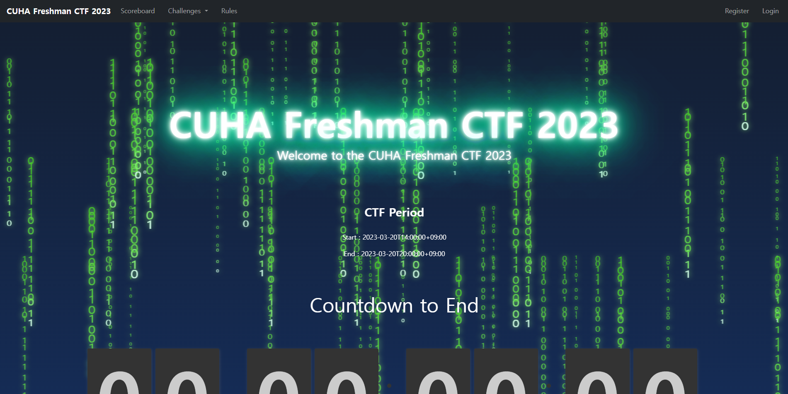
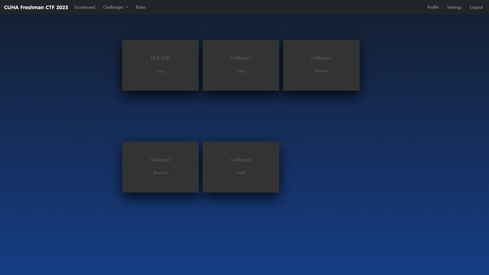
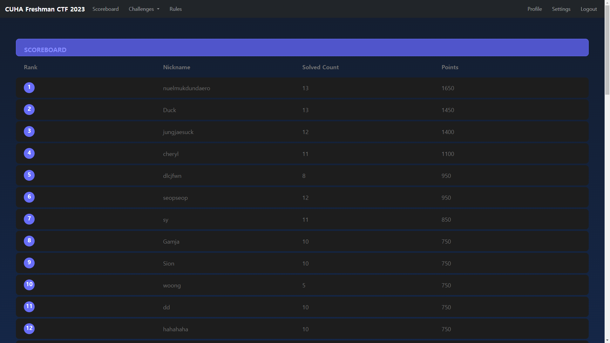

# CUHA_CTF_2023
신입생들을 위한 CUHA배 CTF

# How to use
1. npm i 를 입력하여 필요한 모듈들을 설치함
2. mysql로 cuha_ctf라는 db를 하나 생성함
3. config/config.json 파일을 자신의 db setting에 맞게 수정함
4. npm start를 하여 백엔드 서버를 동작함
5. 127.0.0.1로 접속함

# Images
1. index_page  

2. challenge_page  

3. scoreboard_page  

